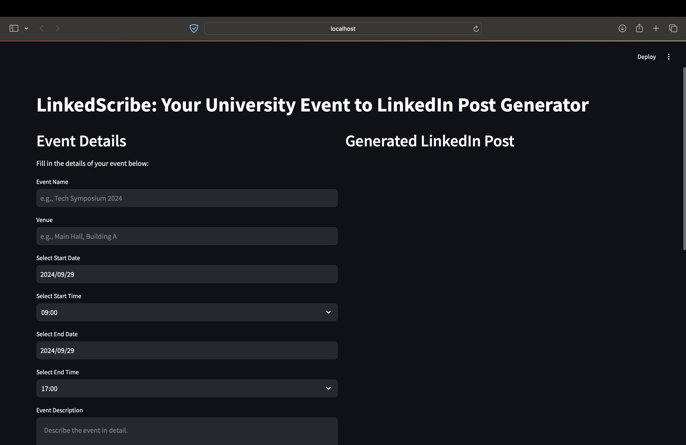
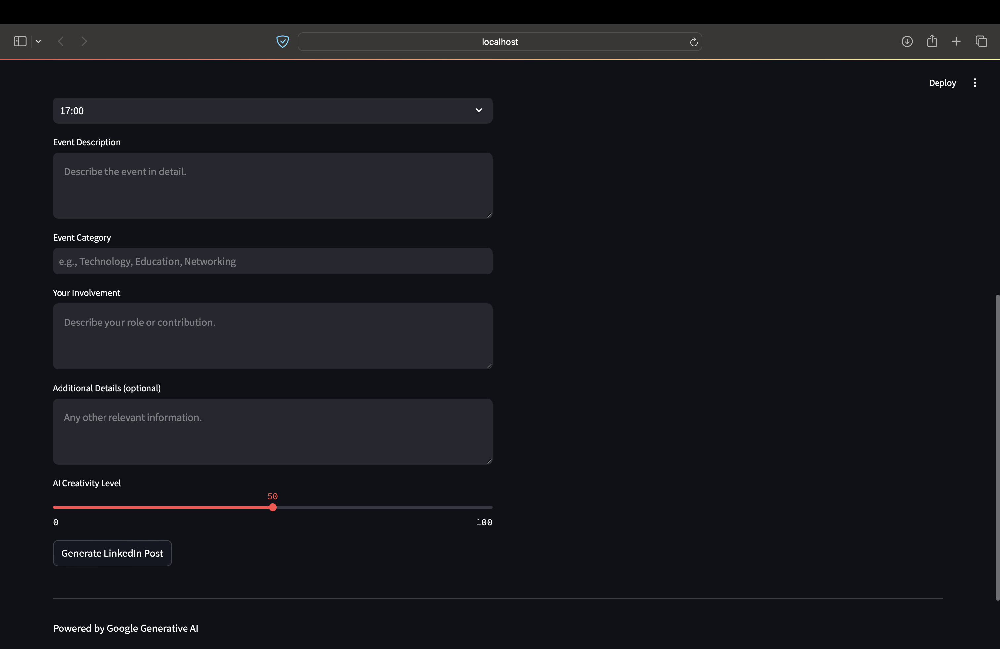
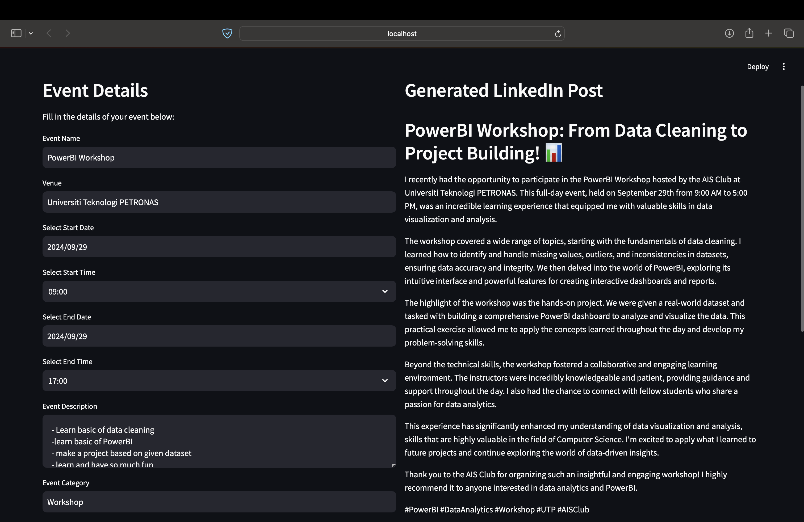
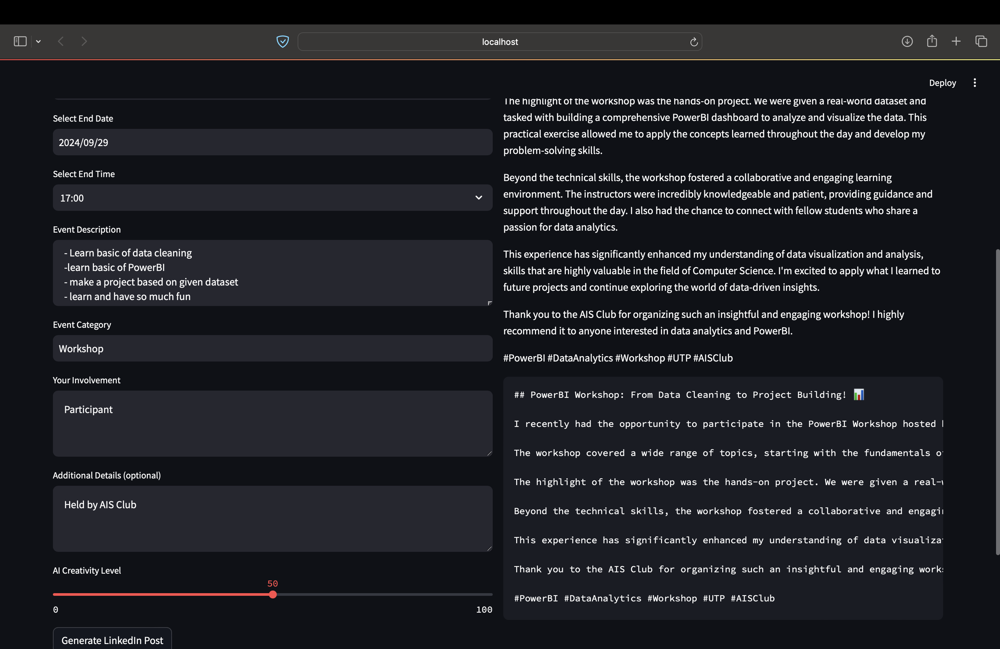

# LinkedIn Post Generator

LinkedIn Post AI is a web application that helps university students effortlessly generate professional LinkedIn posts based on their event experiences. Powered by Google Generative AI, it allows users to input event details and receive a polished post ready for sharing on LinkedIn.

<p align="center">
  
  
</p>

## Features

- **User-Friendly Interface**: Simple and intuitive design for easy navigation.
- **Event Details Input**: Collects essential event information, including name, venue, date, time, description, and personal involvement.
- **AI-Powered Content Generation**: Utilizes Google Generative AI to create engaging and professional LinkedIn posts.
- **Adjustable Creativity Level**: Users can set the creativity level for the generated content.
- **Output Display**: The generated LinkedIn post is displayed in real-time for review and copy.

## Technologies Used

- **Streamlit**: For creating the web app interface.
- **Google Generative AI SDK**: For generating content based on user input.
- **Python**: The primary programming language.
- **dotenv**: For managing environment variables securely.
- **Kaggle Notebook Environment**: Used for data cleaning and preprocessing.

## Dataset and Preprocessing

The dataset `job_and_skills.csv` was created through data cleaning and preprocessing using the Kaggle notebook environment. I utilized Kaggle's data manipulation tools to filter, clean, and format the raw data into a structured format that captures job positions and their associated skills. The final processed CSV file is used in this application to provide insights into job requirements and skills.

## Installation

1. Clone this repository:
   
    ```bash
    git clone https://github.com/ikmalsofian/linkedin-post-ai.git
    cd linkedin-post-ai
    ```
    
2. Create a `.env` file in the root directory and add your Google Generative AI API key:

    ```bash
    GEMINI_API_KEY=your_google_generative_ai_api_key
    ```
    
3. Install the required packages:

    ```bash
    pip install -r requirements.txt
    ```

## Usage

1. Run the application:

    ```bash
    streamlit run app.py
    ```
    
2. Open your web browser and go to `http://localhost:8501`.
3. Fill in the event details on the left column and click the **"Generate LinkedIn Post"** button. The generated post will appear on the right column.

<p align="center">
  
  
</p>

## Contributing

Contributions are welcome! If you have suggestions for improvements or new features, please fork the repository and submit a pull request.

## Acknowledgments

- Thanks to Google Generative AI for providing the API that powers this application.
- Special thanks to Kaggle for offering the environment to perform the data cleaning and preprocessing.
- Inspiration from fellow developers and the open-source community.
